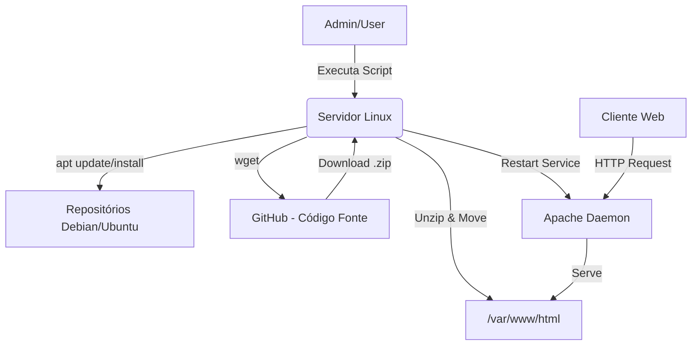

# 🌐 Provisionamento Automatizado de Web Server (Apache2)


> **Infrastructure as Code (IaC):** Script de automação para configuração de servidores web, garantindo agilidade, padronização e redução de erros humanos no processo de deploy.

---

## 📖 Sobre o Projeto

Este projeto consiste em um script em **Bash** robusto projetado para transformar uma instância Linux "limpa" (raw) em um servidor web operacional em poucos segundos.

O script gerencia todo o ciclo de vida do deploy:
1.  Atualização de pacotes do sistema operacional.
2.  Instalação e configuração do serviço HTTP (Apache2).
3.  Obtenção do código-fonte da aplicação via repositório remoto (GitHub).
4.  Implantação dos artefatos no diretório público web.
5.  Limpeza de arquivos temporários e ajuste de permissões de segurança.

### 🏗️ Arquitetura do Processo


----------------------------------------------------------------------------------
### ⚙️ Funcionalidades Técnicas
🛡️ Verificação de Privilégios (EUID Check): O script valida automaticamente se o usuário possui permissões de root. Caso contrário, a execução é interrompida para evitar falhas parciais.

♻️ Idempotência (Preparação de Ambiente): Antes de copiar os novos arquivos, o script limpa o diretório alvo (/var/www/html). Isso garante que deploys subsequentes não misturem versões antigas com novas (evitando "lixo" de versões anteriores).

🧹 Gestão de Resíduos: O download e a extração ocorrem em /tmp. Após a instalação, todos os arquivos temporários são removidos, mantendo o sistema de arquivos do servidor limpo.

🔇 "Quiet Mode" Inteligente: Comandos verbosos (como apt-get e unzip) têm suas saídas técnicas suprimidas (> /dev/null), exibindo ao operador apenas logs de status claros e formatados.

🔒 Hardening Básico: Aplica chown -R www-data nos arquivos implantados, garantindo que o processo do Apache tenha as permissões exatas de leitura/escrita, seguindo o princípio do menor privilégio necessário.

### 🚀 Como Utilizar
Pré-requisitos
- Um servidor rodando Ubuntu (20.04/22.04/24.04) ou Debian.

- Acesso à internet na máquina (portas 80/443 liberadas para saída).

- Porta 80 liberada no Firewall para entrada (HTTP).

#### Passo a Passo
1. Clone ou crie o script no servidor:
```bash
nano script_servidor_web.sh
```
2. Torne o arquivo executável:
```bash
chmod +x script_servidor_web.sh
```
3. Execute (requer privilégios elevados):
```bash
sudo ./script_servidor_web.sh
```

### 🔧 Personalização
O script foi desenhado com variáveis no topo para facilitar a adaptação para outros projetos sem necessidade de refatorar o código lógico.
| Variável | Descrição | Padrão |
| -------- | -------- | -------- |
| REPO_URL | URL direta para o arquivo .zip do repositório | .../main.zip |
| DIR_APACHE | Diretório raiz do servidor web | /var/www/html |
| NOME_ARQUIVO | Nome temporário do arquivo baixado | main.zip |
